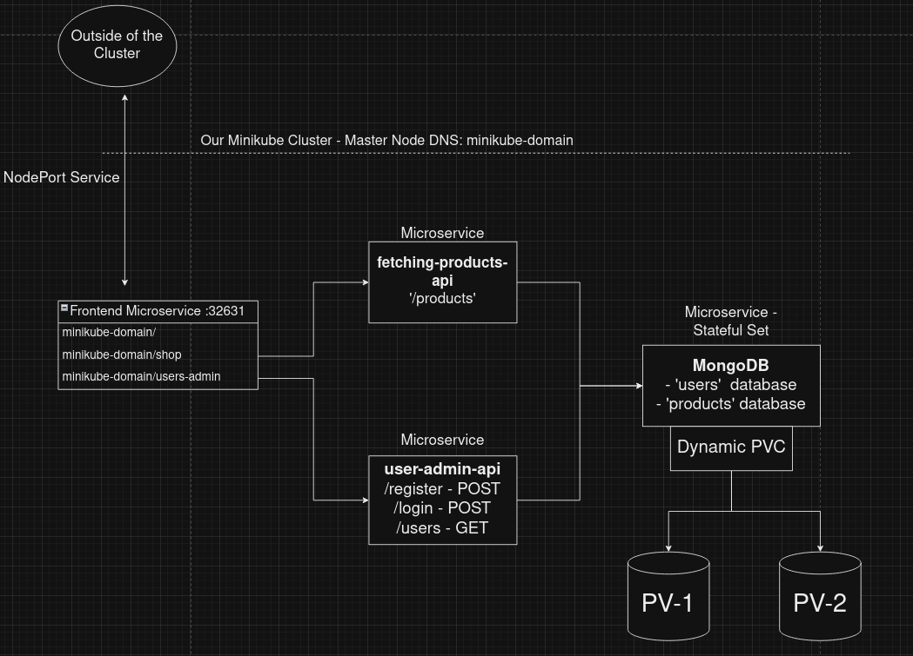
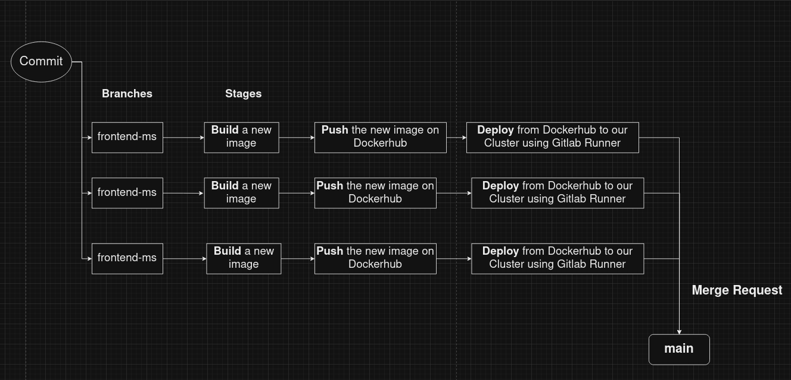
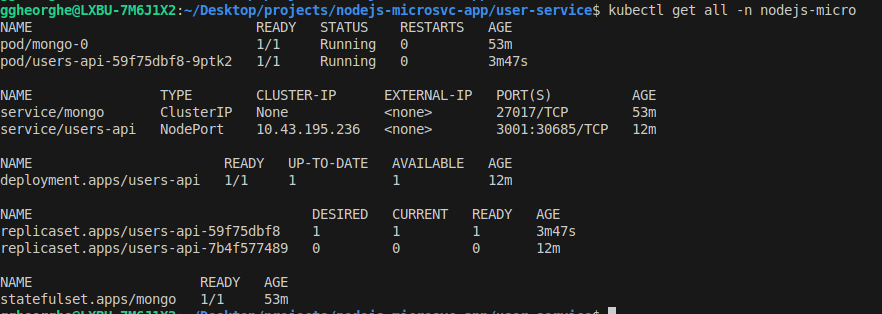
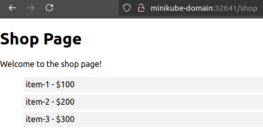
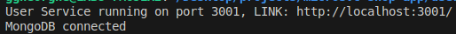
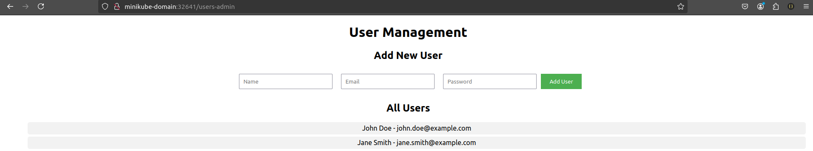

# Microservices Kubernetes Architecture on Minikube Local Cluster with GitLab CI/CD Pipeline and MongoDB Database Integration

This project involves creating a Node.js and React-based microservices application where services communicate via REST APIs. The app is deployed on a Minikube Kubernetes cluster with MongoDB as the database. A GitLab CI/CD pipeline automates building, testing, and deploying Docker images, ensuring continuous integration and efficient updates to the Kubernetes environment.

## This project is structured in 3 parts:
- Designing and Reviewing the Node.js and React Services Code Architecture
- Configuring and Deploying the Application on a Minikube Cluster
- Creating a GitLab CI/CD Pipeline for Automated Deployment





## 1. The Code Review

Each microservice is organized in its own folder, for modularity and clean code separation. MongoDB acts as the central database, providing persistent storage for data shared across the microservices. 

The services are containerized using a `node:18` base image and deployed on a Minikube Kubernetes cluster, allowing for efficient local development and testing in a production-like environment.

The Docker images for each microservice are hosted on DockerHub for easy access and deployment:
- `theodor567/frontend-microservice` - written in React
- `theodor567/fetch-prod-microservice`
- `theodor567/user-microservice`

## 2. Configure and Deploy to Minikube Cluster

The cluster is created locally using Minikube, where I created a new namespace `nodejs-micro`:

        kubectl create namespace nodejs-micro

In this namespace we used the following objects:

#### - **StatefulSets** (and **PVC Templates** for dynamic memory allocation) for MongoDB Database. Also we need to create a **Persistant Volume** for allocating memory.

---

After creating this Database we need to access it using `mongo shell` with the command:

        kubectl exec -it mongo-0 -n nodejs-micro -- mongo

In mongo terminal you have to set the hierarchy of **master and slaves pods** in the folowing way (in our case we create 3 replicas):


```
cat << EOF | kubectl exec -it mongo-0 -- mongo
rs.initiate();
sleep(2000);
rs.add("mongo-1.mongo:27017");
sleep(2000);
rs.add("mongo-2.mongo:27017");
sleep(2000);
cfg = rs.conf();
cfg.members[0].host = "mongo-0.mongo:27017";
rs.reconfig(cfg, {force: true});
sleep(5000);
EOF
```

So, after that we will need 2 database: `products` and `users`, and we create them using:

        use products()
        use users()

And we add date using the following pattern:

        db.<collection_name>.insert({ name: "Example", value: 123 });
        db.<collection_name>.find(); # To verify the data

And our fetching data endpoints will be the following:

1. For **products**: 
        
        mongodb://mongo-0.mongo:27017,mongo-1.mongo:27017,mongo-2.mongo:27017/  products?replicaSet=rs0`
2. For **users**: 

        mongodb://mongo-0.mongo:27017,mongo-1.mongo:27017,mongo-2.mongo:27017/products?replicaSet=rs0

Also we will deploy 2 PVs!



 ---

#### - Deployments and Services for exposing NodeJS Services:

For **products-fetching-api** service, we deploy it using `products-deployment.yaml` where we defined the following environment variable:

``` yaml
containers:
      - name: products-api 
        image: theodor567/fetch-prod-microservice
        env:
          - name: MONGO_CONN_STR_PRODUCTS
            value: mongodb://mongo-0.mongo:27017,mongo-1.mongo:27017,mongo-2.mongo:27017/products?replicaSet=rs0
          - name: MONGO_USERNAME
            valueFrom:
              secretKeyRef:
                name: mongodb-secret
                key: username
          - name: MONGO_PASSWORD
            valueFrom:
              secretKeyRef:
                name: mongodb-secret
                key: password
```

When we call the endpoint in React:



Also when we call **user-admin-api** service in Frontend - where we can also fetch data from `users` database, but also we can add users:




---

- Deployment and NodePort Service for React Frontend:

The React Application is based on 3 routes `minikube-domain/`, `/shop` and `/users-admin` and each page use its microservice, calling the needed endpoint.

**NOTE**: In this project I configured a fake local DNS for my cluster master-node:
```shell
sudo nano /etc/hosts

# And add in this file the DNS:
<master-node-ip>    minikube-domain   
```

This `frontend-service` is exposed at port `32641`, using a NodePort Service at local Master-Node IP:
```yaml
spec:
  selector:
    app: users-admin
  ports:
    - protocol: TCP
      port: 80
      targetPort: 3000
      nodePort: 32641
  type: NodePort
```

## 3. GitLab CI/CD Pipeline Structure:

**Each Microservice on Its Own Branch**

In this project, every microservice has its own branch. This setup allows different developers to work on separate services at the same time without interfering with each other. It makes it easier to manage features and fixes, helping avoid conflicts when merging code into the main branch.

**GitLab Runners Configuration**

These runners help automate the deployment process, ensuring that our latest microservice images are pushed to the cluster without manual intervention. This way, every time we make changes in our code, the runners automatically handle building the new images and updating the services in the cluster, keeping everything in sync.

The pipeline can be viewed on `main` branch in file `.gitlab-ci.yaml`

